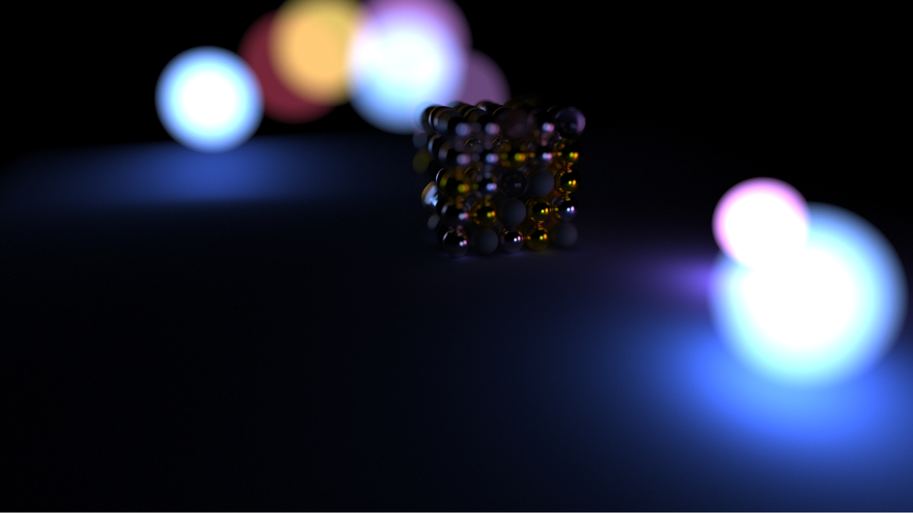

# HART

HART is a multi-threaded software ray tracer written entirely from scratch in C++. The main goal of the project was to educate myself on the basics of ray tracing and to improve my math skills. It's also the perfect exercise to write some multi-threading code which turned out be amazing.

The multi-threading engine is a lock-free (blocking-free) job based system where:
  - The number of threads does not exceed the number of physical threads that are on the CPU.
  - Each thread consists of their own queue to take jobs from.
  - The threadpool inserts jobs into the threads in a round-robin fashion.
  
  
## Screenshots


```
Render Resolution: 640 * 480
Samples per pixel: 512
Ray Bounces: 50
Render time: Instantaneous
```


```
Render Resolution: 640 * 480
Samples per pixel: 4096
Ray Bounces: 10000
Render time: 1.5 hours
```


```
Render Resolution: 1920 * 1080
Samples per pixel: 4096
Ray Bounces: 10000
Render time: ~2 hours
```



```
Render Resolution: 1920 * 1080
Samples per pixel: 16384
Ray Bounces: 64
Render time: 8 hours
```


```
Render Resolution: 1920 * 1080
Samples per pixel: 16384
Ray Bounces: 64
Render time: 8 hours
```

## Renferences
  - [Ray Tracing In One Weekend](https://www.realtimerendering.com/raytracing/Ray%20Tracing%20in%20a%20Weekend.pdf)
  - [Ray Tracing: The Next Week](https://www.realtimerendering.com/raytracing/Ray%20Tracing_%20The%20Next%20Week.pdf)
  - [Scratch A Pixel](https://www.scratchapixel.com/)
  - [1000 Forms of Bunnies](http://viclw17.github.io/)
  - [Molecular Musings](https://blog.molecular-matters.com/2015/08/24/job-system-2-0-lock-free-work-stealing-part-1-basics/)
  - [Game Engine Architecture](https://www.gameenginebook.com/)
  - [Reflections and Refractions in Ray Tracing](https://graphics.stanford.edu/courses/cs148-10-summer/docs/2006--degreve--reflection_refraction.pdf)
